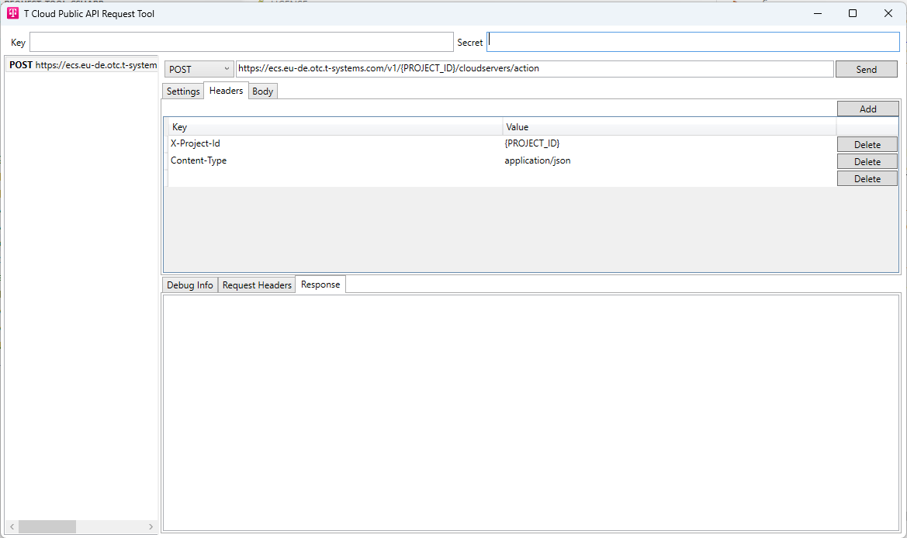

# api-request-tool-csharp

> [!NOTE]
> Work in progress..


Windows tool for sending signed API request to T Cloud Public.



Tool uses:
- https://github.com/opentelekomcloud-community/otc-api-sign-sdk-csharp

## Environment variables 

```
$env:GITHUB_USERNAME = 
$env:GITHUB_TOKEN = 
$env:OTC_SDK_AK =
$env:OTC_SDK_SK =
```

## Build

```
dotnet build api-request-tool.csproj -c Debug
```

## Run

```
dotnet run --project api-request-tool.csproj -c Debug
```

## Build standalone exe

```
dotnet publish .\api-request-tool.csproj -c Release
```

Equivalent explicit command:

```
dotnet publish .\api-request-tool.csproj -c Release -r win-x64 --self-contained true /p:PublishSingleFile=true /p:IncludeNativeLibrariesForSelfExtract=true /p:DebugType=None /p:DebugSymbols=false
```

Output will be in:

```
bin/Release/net8.0-windows/win-x64/publish
```

Main file is:

```
bin/Release/net8.0-windows/win-x64/publish/request-tool.exe
```


> Warranty Disclaimer
> -------------------
> THE OPEN SOURCE SOFTWARE IN THIS PRODUCT IS DISTRIBUTED IN THE HOPE THAT IT
> WILL BE USEFUL,BUT WITHOUT ANY WARRANTY; WITHOUT EVEN THE IMPLIED WARRANTY
> OF MERCHANTABILITY OR FITNESS FOR A PARTICULAR PURPOSE.
> 
> SEE THE APPLICABLE LICENSES FOR MORE DETAILS.
